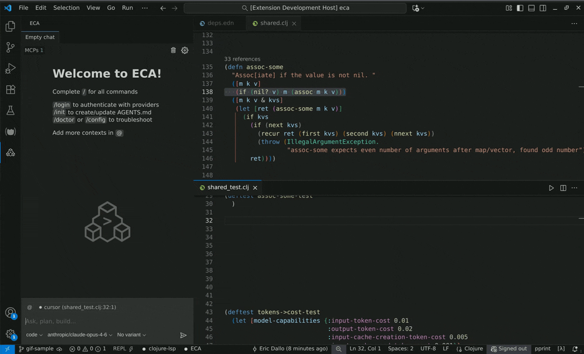

# ECA vscode

[](./LICENSE)



ECA (Editor Code Assistant) Vscode is an AI-powered pair-programming client for VsCode.
It connects to an external `eca` server process to provide interactive chat, code suggestions, context management and more.

For more details about ECA, features and configuration, check [ECA server](https://github.com/editor-code-assistant/eca).

This extension will auto download `eca` and manage the process.

## Tips

### Commands

- `eca.chat.addContextToSystemPrompt`: Add context to system prompt in chat in a DWIM (do what I mean) manner.
- `eca.chat.rewrite`: Rewrite a piece of code given a prompt.
- `eca.inlineChat.prompt`: Ask ECA from any file, streaming the answer into a comment thread at the cursor/selection, backed by a regular chat. On first use you can fork an existing chat to reuse its history; the chat sticks to the file for follow-ups. Follow-up, stop and tool call approvals happen in the thread.
- `eca.inlineChat.promptSelecting`: Same as above but always re-asks which chat to use.

### Settings

- `eca.serverPath`: Custom server path, if not set it will download latest server from https://github.com/editor-code-assistant/eca
- `eca.serverArgs`: Extra server args used when starting eca server.
- `eca.sendProcessId`: Whether to send the VS Code process ID to the server so it exits when the editor does (default `true`). Disable it when sandboxing, see below.

### Sandboxing

You can run the eca server under any sandbox tool (docker, podman, bubblewrap, etc.) by pointing `eca.serverPath` to a wrapper script that starts the server inside the sandbox. The server is started with the first workspace folder as working directory, so the wrapper can rely on `$PWD` being the project (e.g. to mount it in a container). Check the [sandboxing docs](https://eca.dev/config/sandboxing/) for ready-to-use wrappers.

When the sandbox hides or remaps the host PID (containers), also disable `eca.sendProcessId`, otherwise the server's parent-process watchdog can't see the PID and shuts down right after startup:

```json
{
  "eca.serverPath": "/home/you/.local/bin/eca-sandboxed",
  "eca.sendProcessId": false
}
```

## Troubleshooting

Check [troubleshooting](http://eca.dev/troubleshooting) docs section.

## Development
Make sure that you have the `eca-webview` submodule cloned. To download it, you can run:
```
git submodule update --init --recursive
```

### Run locally

```bash
npm run dev:gui
```

This will start Vite dev server on `http://localhost:5173`, so any changes will be updated on the vscode live.

then start vscode on debug mode, open this project in vscode and hit F5 (Debug), this should open a new vscode extension with this plugin running.

WARN: To run the task from VsCode, need to install the [esbuild Problem Matchers](https://marketplace.visualstudio.com/items?itemName=connor4312.esbuild-problem-matchers) extension.
