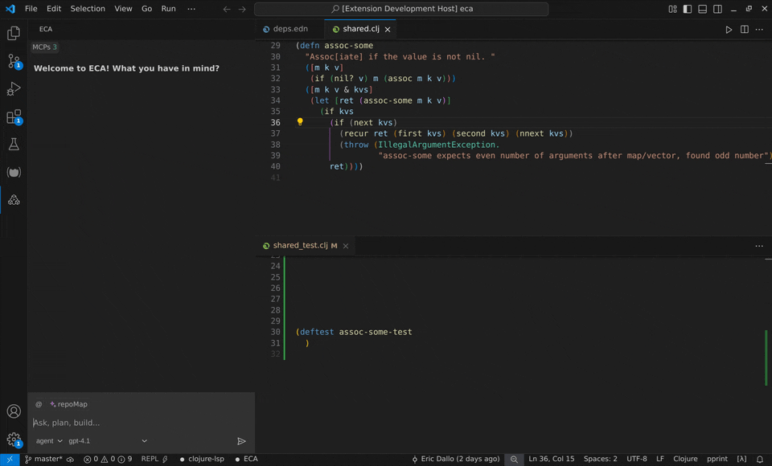

# ECA vscode

:warning: The project is still alpha and experimental, with bugs and missing features, but being consistenly improved.

[](./LICENSE)



ECA (Editor Code Assistant) Vscode is an AI-powered pair-programming client for VsCode.
It connects to an external `eca` server process to provide interactive chat, code suggestions, context management and more.

For more details about ECA, features and configuration, check [ECA server](https://github.com/editor-code-assistant/eca).

This extension will auto download `eca` and manage the process.

## Settings

- `eca.serverPath`: Custom server path, if not set it will download latest server from https://github.com/editor-code-assistant/eca
- `eca.serverArgs`: Extra server args used when starting eca server.

## Development

```bash
npm run dev:gui
```

This will start Vite dev server on `http://localhost:5173`, so any changes will be updated on the vscode live.

then start vscode on debug mode, open this project in vscode and hit F5 (Debug), this should open a new vscode extension with this plugin running.

